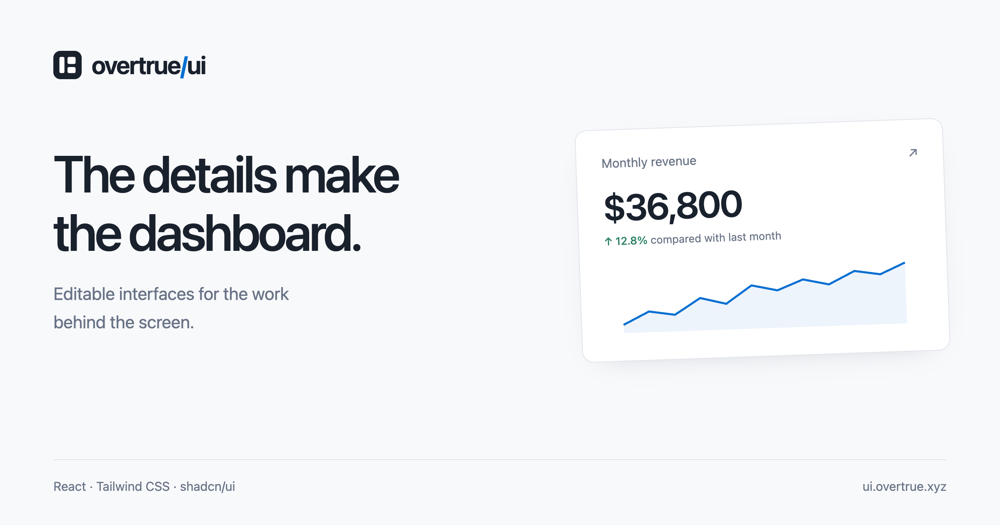

# overtrue/ui

Editable components and page patterns for admin panels, dashboards, and consoles. Built with React, TypeScript, Tailwind CSS v4, and shadcn/ui.

[Website](https://ui.overtrue.xyz) · [Components](https://ui.overtrue.xyz/components) · [Blocks](https://ui.overtrue.xyz/blocks) · [Documentation](https://ui.overtrue.xyz/docs) · [Examples](https://ui.overtrue.xyz/examples)

[](https://ui.overtrue.xyz)

Install the pieces you need through the shadcn CLI. The source goes into your application, where you can change the markup, styling, and behavior without maintaining a fork of a component package.

## What's included

- **58 components:** metrics, charts, tables, activity feeds, navigation, forms, and other building blocks for everyday admin work. Each has live examples, source, usage, and installation instructions.
- **Four complete interfaces:** a dashboard, analytics overview, project portfolio, and service status page.
- **368 example card patterns:** extracted from the same source used by the workspace pages, including their sample data and local interactions.
- **119 workspace examples:** projects, people, billing, inboxes, settings, authentication, layouts, and component demonstrations.
- **Light and dark themes:** semantic colors, responsive layouts, and Tabler Icons throughout. The workspace also includes controls for accent, typography, radius, and navigation.

The [component catalog](src/site/catalog.ts) and generated card catalog are the source of truth. Counts change as examples are added or reorganized.

## Install a component

Start with a React application using **Tailwind CSS v4** and an initialized **shadcn/ui** setup. This repository uses React 19; the CLI resolves the dependencies declared by each item.

```sh
# Run this first if your application does not have shadcn/ui configured.
npx shadcn@latest init

# Add a component and its dependencies.
npx shadcn@latest add https://ui.overtrue.xyz/r/stat-card.json
```

Use the installed source:

```tsx
import { StatCard } from "@/components/overtrue/stat-card"

export function Revenue() {
  return (
    <StatCard
      title="Monthly revenue"
      value="$36,800"
      change="12.8%"
      trend="up"
      description="vs. last month"
      sparkline={[18, 24, 21, 30, 27, 36]}
    />
  )
}
```

The import assumes your `@` alias points to the application source directory. Use the destination configured in your own `components.json`.

### Use a registry namespace

Merge this entry into your application's `components.json`:

```json
{
  "registries": {
    "@overtrue": "https://ui.overtrue.xyz/r/{name}.json"
  }
}
```

Then install by name:

```sh
npx shadcn@latest add @overtrue/stat-card
npx shadcn@latest add @overtrue/activity-heatmap
npx shadcn@latest add @overtrue/dashboard
```

`@overtrue` is a namespace you configure locally. This project is distributed through a shadcn registry, not an npm package. It is not listed in the official shadcn Directory.

### Components, blocks, and workspace pages

| Choose | For | What gets installed |
| --- | --- | --- |
| Components | Individual UI patterns | Editable source, local helpers, required shadcn primitives, and npm dependencies |
| Complete interfaces | A composed screen to customize | The screen and its component dependencies |
| Example card blocks | A card from a workspace example | The card plus a shared foundation with scoped styles and demo interaction primitives |
| Workspace pages | Exploring layouts and workflows | Browse or adapt the repository source; these pages are not individually installable registry items |

Core components inherit your application's shadcn theme and do not require the workspace stylesheet. Example card blocks use a separate foundation under `components/overtrue/blocks/runtime/` to preserve their appearance without replacing your application's UI primitives. Some card imagery is served from the registry origin; replace it with your own assets before using it in a product.

The optional `@overtrue/overtrue-theme` item updates global CSS variables. Review those changes if your application already has a theme.

Read the [composition guide](docs/registry/compositions.md), [card block guide](docs/registry/cards.md), and [dashboard component notes](docs/registry/dashboard-components.md) for the installation boundaries and APIs.

## Run locally

Requires **Node.js 22.18 or newer** and **pnpm 10.32.1**. No application secrets or backend service are needed to run the demos.

```sh
git clone https://github.com/overtrue/ui.git
cd ui
pnpm install --frozen-lockfile
pnpm registry:build
pnpm dev
```

Open `http://localhost:5173` for the website, or `http://localhost:5173/workspace/` for the workspace. Generate the registry before the first dev run: the site imports the generated card catalog.

To install a locally modified component into another application while the dev server is running:

```sh
npx shadcn@latest add http://localhost:5173/r/stat-card.json
```

### Useful commands

| Command | Purpose |
| --- | --- |
| `pnpm dev` | Start the website and workspace development server |
| `pnpm blocks:prepare` | Extract cards and their catalog from example source |
| `pnpm registry:build` | Extract cards, resolve dependencies, and generate public registry JSON |
| `pnpm typecheck` | Check TypeScript after registry generation |
| `pnpm build` | Regenerate the registry, check types, and build all site entries |
| `pnpm preview --port 4175` | Serve the production build locally |
| `pnpm registry:check` | Rebuild and verify registry sources, dependencies, and installation targets |
| `pnpm content:check` | Check branding, local asset paths, page metadata, navigation, and attribution |
| `pnpm site:check` | Run browser checks against a running production preview |

Browser checks use Playwright CLI and require Chrome. With a production preview running:

```sh
SITE_URL=http://127.0.0.1:4175 pnpm site:check
PREVIEW_URL=http://127.0.0.1:4175/workspace/ node scripts/examples/verify-workspace.mjs
PREVIEW_URL=http://127.0.0.1:4175/workspace/ node scripts/examples/verify-workspace.mjs --mobile
```

Screenshots and verification output stay in the ignored `output/` directory. See [registry verification](docs/registry/verification.md) and [workspace verification](docs/examples/verification.md) for additional checks. A build passing does not replace reviewing the rendered interface.

## Repository layout

```text
src/registry/overtrue/             Installable components and complete interfaces
src/site/                         Website, documentation, catalogs, and examples
src/pages/workspace/              Workspace route modules
src/components/overtrue/scenes/   Composed business pages
src/components/overtrue/workspace/ Workspace navigation and interaction adapters
src/components/ui/                Shared UI primitives
src/data/workspace/               Route inventory and demo data
src/blocks/                       Card preview runtime and generated card sources
src/styles/                       Scoped workspace styles
scripts/blocks/                   Card extraction and packaging
scripts/registry/                 Registry generation and verification
public/assets/                    Example imagery, icons, and fonts
licenses/                         Third-party notices
```

Edit the original component or workspace example, then regenerate. `registry.json`, `public/r/`, the card catalog, and generated block sources are build outputs and are not committed.

The website, workspace, and isolated card preview are separate Vite entries. Workspace styles are kept out of the component website. [DESIGN.md](DESIGN.md) describes typography, density, color, spacing, and interaction conventions.

## Deploy

Import the repository into Vercel as a Vite project. The checked-in `vercel.json` uses `npm run build`, publishes `dist/`, and configures website routes and registry headers.

Set this build environment variable for a stable public registry origin:

```text
REGISTRY_ORIGIN=https://ui.overtrue.xyz
```

Without it, registry generation uses `https://$VERCEL_URL` on Vercel or `http://localhost:5173` locally. Visible install commands use the website's current origin. For another domain, also update canonical metadata in `vite.config.ts` and `index.html`.

The output is static and can be hosted elsewhere. Preserve the generated page paths, `/workspace/`, `/card-preview.html`, and `/r/`; registry JSON needs to remain publicly accessible. Verify the deployed pages and installation URLs after publishing. Local checks do not establish deployment or DNS status.

## Demo boundaries

Acme Studio is a sample workspace. Client records, contact details, and financial figures are demo data. People are fictional except for the maintainer’s public GitHub profile used in a few avatar examples. Forms and business workflows use local state; the examples do not provide authentication, payment processing, email delivery, or a backend. Wire those behaviors into your own application.

Maps fetch external tiles. Charts and tables declare their own dependencies; the newer analytics charts use a separate Recharts 3 alias so they can coexist with the existing Recharts 2 examples. Review the [compatibility notes](docs/registry/dashboard-components.md) before changing chart dependencies.

## Contributing

Small, focused improvements are welcome. See [CONTRIBUTING.md](CONTRIBUTING.md) for source locations, generation steps, and verification expectations. For UI bugs, include the page, viewport, theme, and a screenshot or reproduction steps.

## License and credits

[MIT](LICENSE). Built with [shadcn/ui](https://ui.shadcn.com/), [React](https://react.dev/), [Tailwind CSS](https://tailwindcss.com/), and [Tabler Icons](https://tabler.io/icons).

Third-party styles, code, and assets retain their applicable [copyright and license notices](licenses/third-party.txt). Keep those notices when redistributing adapted source.
